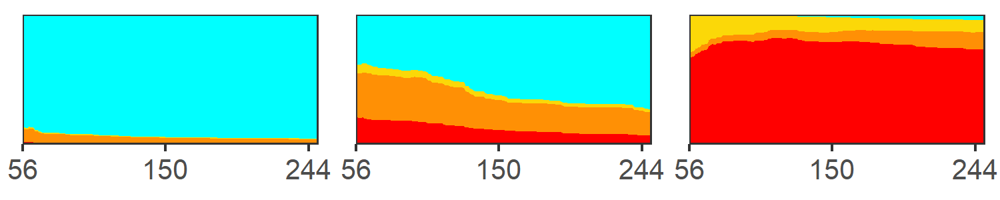

\newcommand{\1}{\textbf{1}}

W. Alton Russell^1^, others

<br>

^1^School of Population and Global Health, McGill University, Montreal, Canada

<br>

**Corresponding author:**

**Key words:**

**Running title:**

##### 

```{r setup, include=FALSE}
library(ggplot2) #plots
library(data.table) #for using datatables instead of frames
library(scales) #formatting plot legends and text
library(readxl) #read.excel
library(flextable) #generating tables
library(ftExtra)
library(officedown) #formatting for word
library(officer)
library(stringr)
theme_set(theme_bw())
knitr::opts_chunk$set(
  echo       = FALSE,
  message    = FALSE,
  warning    = FALSE
)

#takes table column containing references for sources
gen_tab_sourcestr <- function(sources_raw){
  sources <- str_match(sources_raw, ".*\\[@\\s*(.*?)\\s*\\]")[,2]
  #remove NA
  sources <- sources[!is.na(sources)]
  #attack '@
  sources <- paste0("@", sources)
  #add commas
  sources[-length(sources)] <- paste0(sources[-length(sources)], "; ")
  sources <- paste0("[", paste0(sources, collapse=""), "]")
  return(sources)
}

```

```{r}
df_samp <- read_excel("../1_data/tables.xlsx", sheet = "sample")
sourcestr_t_samp <- gen_tab_sourcestr(df_samp$Source)
```

# Abstract

**Background:** A

**Methods:** A

**Results:** A

**Conclusions:** A

##### 

# Introduction

> Citation [@Langham2018a]

<br>

# Methods

> See `r run_reference("t-sample")` `r sourcestr_t_samp` and \@ref(tab:t-sample-2).

## Subsection

> See `r run_reference("f-sample")`. See `r run_reference("f-sample-2")`.

<br>

# Results

> A

<br>

# Discussion

> A

<br>

##### 

# Declarations

**Funding:** A

**Conflicts:** A

**Ethics/Consent:** A

**Data and materials:** A

**Code availability:** A

**Authors' contributions:**

##### 

# References

::: {#refs}
:::

##### 

# Tables

```{r}
tab_num <- run_autonum(seq_id = "tab", 
                       pre_label = "Table ", 
                       bkm="t-sample",
                       bkm_all = TRUE,
                       prop = fp_text(bold=TRUE, underlined = TRUE))


t_samp <- as_flextable(as_grouped_data(df_samp,
                                              groups = "subhead"))
t_samp <- compose(t_samp, i = ~ !is.na(subhead), j = "col1",
              value = as_paragraph(as_chunk(subhead)))

t_samp <- fontsize(t_samp, size = 10, part = "all")
t_samp <- font(t_samp, fontname = "Times", part = "all")
t_samp <- theme_box(t_samp)
t_samp <- bg(t_samp, bg = "#EAEAEA", part = "header")
t_samp <- width(t_samp, 1, 1.7)
t_samp <- bg(t_samp, i = c(1, 4), bg = "#DDDDDD", part = "body")
t_samp <- bold(t_samp, i = c(1, 4), part = "body")
t_samp <- align(t_samp, align = "left", part = "all")
t_samp <- set_caption(t_samp,
                      "This is a sample table.",
                      autonum = tab_num)
# t_samp <- footnote(t_samp, i=1, j=1, part="header",ref_symbols ="1",
#                          value=as_paragraph("This is a footnote."))
t_samp <-  colformat_md(t_samp, j=2:4, part="body",
                        pandoc_args = c('--csl', 'refs-in-tables.csl'))


t_samp
```

##### 

# Figures

```{r fig.width=5, fig.height=1}
fig_num <- run_autonum(seq_id = "fig",
                       pre_label = "Figure ",
                       bkm="f-sample",
                       bkm_all = TRUE,
                       prop = fp_text(bold=TRUE, underlined = TRUE))



block_caption("This is a figure caption.", 
              style = "Image Caption", 
              autonum = fig_num)

```

##### 

# Supplemental materials

<br>

# A. Supplement section

##### 

# Supplemental tables

```{r}
stab_num <- run_autonum(seq_id = "stab", 
                       pre_label = "Table S", 
                       bkm="t-sample-2",
                       bkm_all = TRUE,
                       prop = fp_text(bold=TRUE, underlined = TRUE))

t_samp <- as_flextable(as_grouped_data(read_excel("../1_data/tables.xlsx", sheet = "sample"),
                                              groups = "subhead"))
t_samp <- compose(t_samp, i = ~ !is.na(subhead), j = "col1",
              value = as_paragraph(as_chunk(subhead)))
t_samp <- fontsize(t_samp, size = 10, part = "all")
t_samp <- font(t_samp, fontname = "Times", part = "all")
t_samp <- theme_box(t_samp)
t_samp <- bg(t_samp, bg = "#EAEAEA", part = "header")
t_samp <- width(t_samp, 1, 1.7)
t_samp <- bg(t_samp, i = c(1, 4), bg = "#DDDDDD", part = "body")
t_samp <- bold(t_samp, i = c(1, 4), part = "body")
t_samp <- set_caption(t_samp,
                      "This is a sample table.",
                      autonum = stab_num)
t_samp <- align(t_samp, align = "left", part = "all")
t_samp <-  colformat_md(t_samp, j=2:4, part="body")

t_samp
```

##### 

# Supplemental figures

```{r}
#sfig_autonum <- run_autonum(seq_id = "sfig", pre_label = "Figure S", bkm="f-sample-2", start_at=1)
```

```{r, fig.width=5, fig.height=1}

sfig_num <- run_autonum(seq_id = "sfig", 
                       pre_label = "Figure S", 
                       bkm="f-sample-2",
                       bkm_all = TRUE,
                       prop = fp_text(bold=TRUE, underlined = TRUE))


block_caption("A figure caption.", 
              style = "Image Caption", 
              autonum = sfig_num)
```
